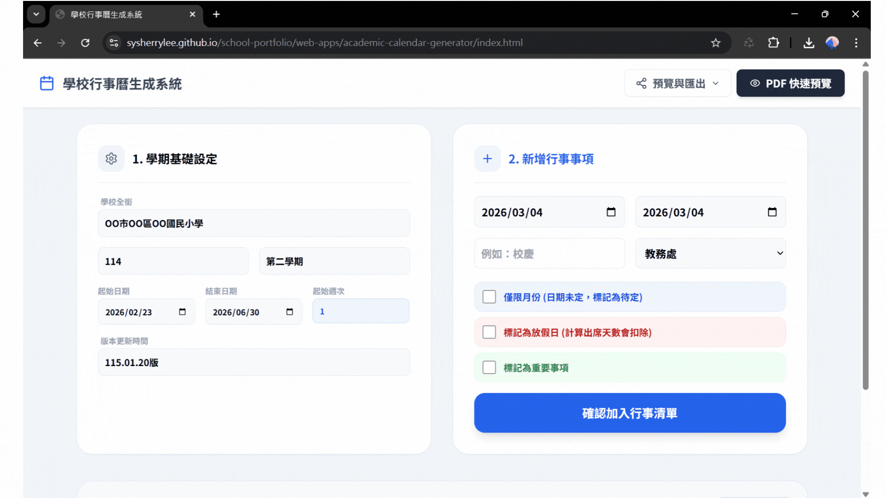

# 行事曆生成系統README

# 📅 Academic Calendar Generator| 學校行事曆生成系統

## 🔗系統連結

> [**立即開啟系統：學校行事曆自動生成系統**](https://sysherrylee.github.io/school-portfolio/web-apps/academic-calendar-generator/index.html)

## 💡一次輸入，多元產出

為了讓學校行政更輕鬆，把時間花在更重要的事情上，所以製作出這個讓行事曆自動化的系統。

只需要輸入一次資料， 系統就能自動抓取日期對應月份、標色分類，並產出多種符合教育現場需求格式的行事曆，譬如給學校同仁分處室版、給家長的一頁簡曆版或是貼在班上的月曆版，省下重新排版校對時間。

系統支援匯出google日曆的`.ics`格式 跟 行事清單`.docx/JSON`格式，能讓校務直接同步google日曆，以及能進行備分存檔。

## 🚀 特色功能

| **功能特色**       | **詳細說明**                                                                                           | **預期效益**                                             |
| ------------------ | ------------------------------------------------------------------------------------------------------ | -------------------------------------------------------- |
| **彈性日期設定**   | 自行定義學期開始與結束日期，系統自動抓取對應月份，無須手動繪製表格。以及能自動計算週次及學生出席天數。 | 減少每學期重新排版跟週次、出席天數等計算，降低行政負擔。 |
| **同步Google日曆** | 支援匯出 `.ics` 標準格式，一鍵將校務行事匯入Google日曆。                                               | 達成校務google行事曆同步。                               |
| **多種匯出格式**   | 提供「行政報表」、「家長簡曆」、「月曆視覺版」等不同排版選擇。                                         | 滿足不同人的資訊需求。                                   |
| **醒目顏色標記**   | 系統自動標記重要事項與放假日。                                                                         | 強化重要日期或事項，提升溝通效率。                       |
| **資料備份與還原** | 支援 `JSON` 格式下載與匯入，確保進度不遺失。                                                           | 支援資料匯出還原功能，能跨裝置存取編輯進度。             |

## 📢 如何使用

1. **設定基礎資訊**：填寫校名、學年度、學期，並選擇日期範圍。
2. **登錄行事事項**：選擇日期、處室分類，並標記是否為重要事項或放假日。
3. **即時預覽與調整**：下方清單可隨時刪除或修改錯誤輸入。
4. **選擇匯出格式**：點擊「預覽與匯出」，選擇您需要的匯出版本。

## 💬 未來優化方向

- **放大介面字體**：強化使用者體驗。
- **擴充 Excel 上傳下載版本**：結合既有檔案並支援大量資料輸入。
- **新增教育局要求格式**：增加系統的應用價值。
